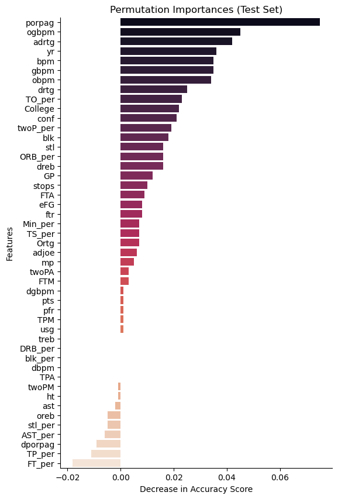
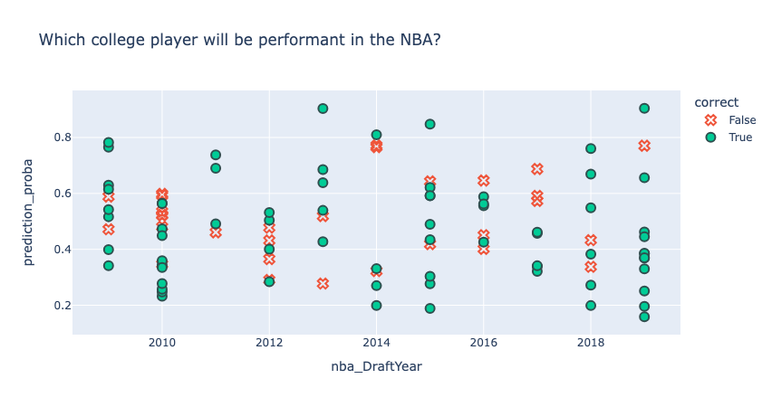

*Photo credit: NBA.com*

### College to NBA Player Performance Prediction
*The full Jupyter Notebook can be viewed on [nbviewer](https://nbviewer.org/github/d-veli/college_to_nba_prediction/blob/e78ae7b04636d8d5aff2251def1472a21e5d1fe9/college_to_nba_capstone.ipynb)
or [GitHub](https://github.com/d-veli/college_to_nba_prediction/blob/main/college_to_nba_capstone.ipynb). The nbviewer option is recommended to view interactive plots that GitHub preview does not render.*

**Author: Dave Li**

#### Executive summary
A player's college basketball performance does not always translate to NBA performance due to a variety of factors (ie. change in rules, play styles, level of competition, usage). This work aims to improve on the status quo by applying machine learning to more accurately predict whether or not a given college player will be performant in the NBA.

#### Rationale
From a business perspective, NBA drafts have been notorious crapshoots where it is not uncommon for players drafted from college to end up underperforming their expected value. This a huge waste of organizational investment in terms of time and money, not to mention the opportunity cost of a better replacement player. Thus, being able to determine a college player's likelihood of being performant in the NBA becomes a valuable tool for teams when investing in new talent direct from college. 

#### Research Question
To be explicit then, our research question and data mining objective is to make use of machine learning so that NBA prospects coming out of college can be more accurately assessed on their likelihood to be performant in the big leagues. 

#### Data Sources
[College Basketball 2009-2021 + NBA Advanced Stats](https://www.kaggle.com/datasets/adityak2003/college-basketball-players-20092021)
- **Description**: Contains college statistics from 2009-2021 + advanced NBA stats from 2014-2022. 
- **Rationale**: This source will provide the college performance data to be used as the independent variables.

[20 Years of NBA Draft Data](https://www.kaggle.com/datasets/benwieland/nba-draft-data)
- **Description**: NBA statistics for every pick, along with NCAA stat page links for data scraping. 
- **Rationale**: This source will provide the list of college players who were drafted into the NBA. This will be the primary source on which the college statistics will be merged against. Additionally, the NBA statistics cover the length of each players career to date which will be used as inputs to our dependent variable.

#### Methodology
The methodologies used include:
- **Data Preparation:** Pandas and Numpy to join data sources and manage data quality
- **Data Exploration:** Seaborn, Plotly Express, Matplotlib to visualize relationships
- **ML Modeling:** Sklearn to preprocess, transform, and search for optimal classfication models. Keras and Tensorflow for building and evaluation neural network based classification models.

#### Results
In our research, the resulting best model found over 70% accuracy in predicting whether a college player will be performant in the NBA.

Our approach defined a performant player as one who lasted at least three years in the league, had positive WS/48 (Win shares), and positive VORP (Value Above Replacement Player). Additionally, we prepared over 45 features (including traditional box score and advanced stats for college performance) as inputs to the model. 

Using the above problem framing, the best classification model (logistic regression) found the following features as being most important in identifying whether a college player will be performant in the NBA:

- Points over replacement per adjusted game
- Box plus/minus (offense and defense included)
- Adjusted defensive rating
- Last year of college (before entering NBA)

The full list of features and their importances is shown below.

Finally, the plot below shows the model's prediction results on a subset of college players drafted into the NBA through the years. 
- The y-axis shows the model's prediction probability for a given player (above 0.5 is considered performant)
- The x-axis shows the NBA draft class
- The color and marks both serve as indication on whether the prediction was correct

Notable correct predictions include James Harden (2009), Blake Griffin (2009), John Wall (2010), Damian Lillard (2012), Draymond Green (2012), and Trae Young (2018).

#### Next steps
Our results improve upon the status quo and provide a data-driven tool that supports the high cost decision of drafting a college player into the NBA. However, we acknowledge limitations in the data available that restricts the possibility of even better models. As such, future research would benefit in model improvements through: 
1. Inclusion of additional features such as
    - Player vitals (ie. weight, wingspan, college injuries)
    - Expanded college statistics (ie. multi-year, additional advanced stats)
2. Reframing the problem differently (ie. as a regression problem)
    - Predicting VORP or other measure of player performance
    - Predicting the monetary gain/loss using games won
3. Acquire primary data to improve data quality and allow for flexibility in problem modeling choices, including:
    - Normalizing the time-frame for NBA performance used as target (ie. use only first three years of performance data for all players)
    - Increasing the sample size available for models to learn from

Additional research scope not addressed but worth exploring include:
1. Evaluation of international players
2. Evaluation of undrafted college players that made it into NBA

#### Outline of project

- [College to NBA Capstone - Jupyter Notebook](https://github.com/d-veli/college_to_nba_prediction/blob/main/college_to_nba_capstone.ipynb)

#### Contact and Further Information